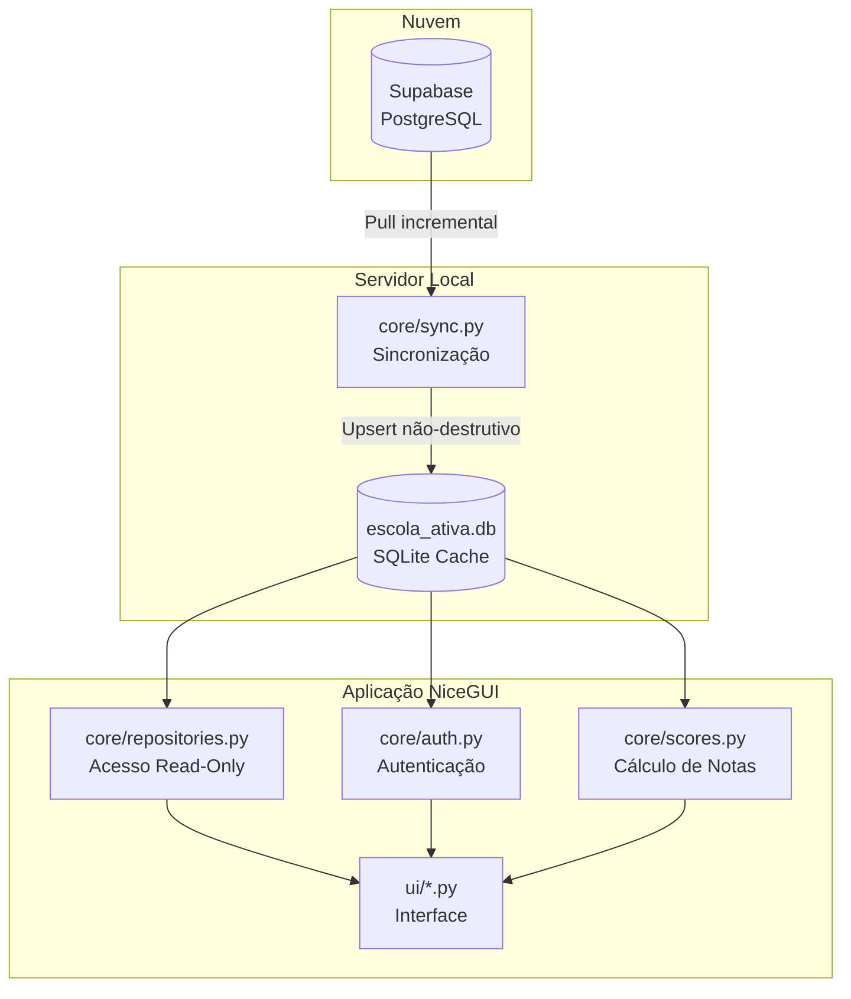
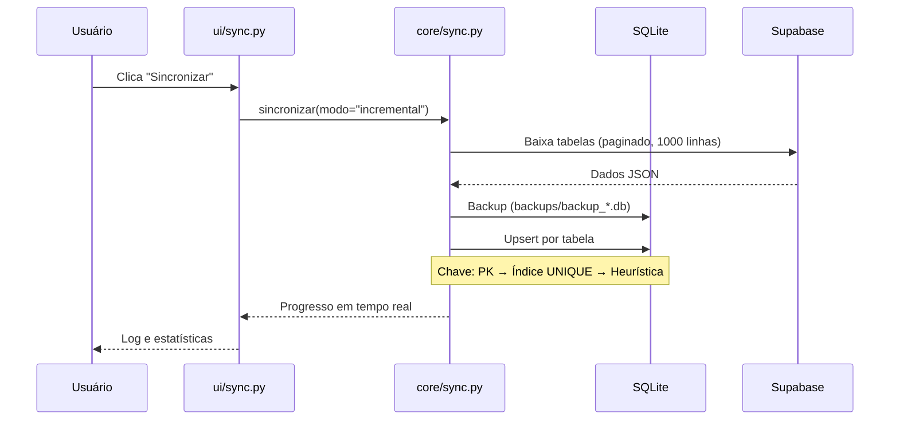
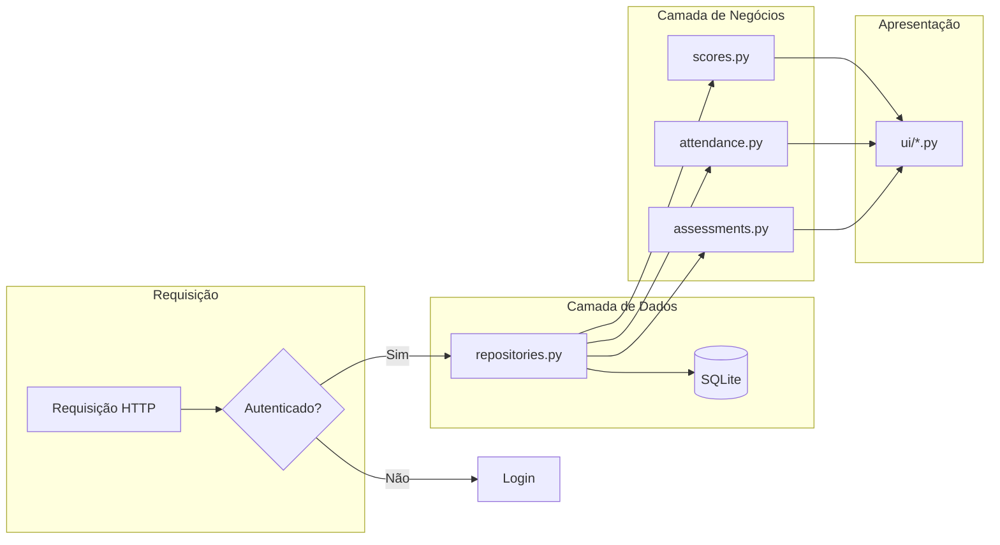
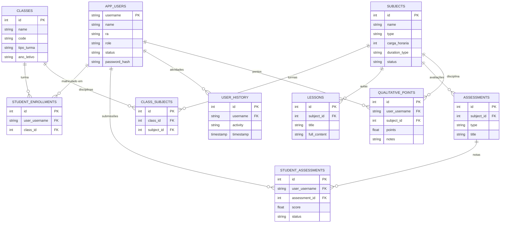
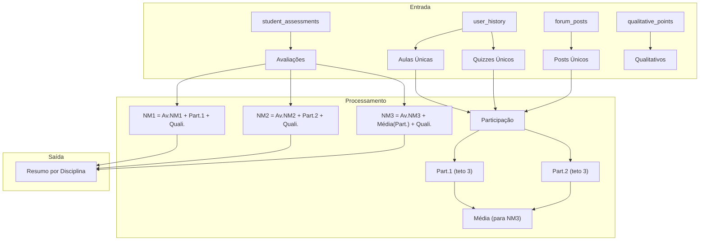
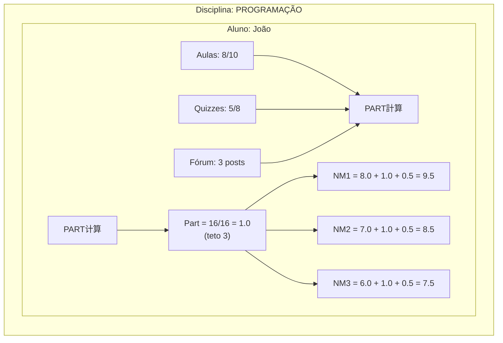
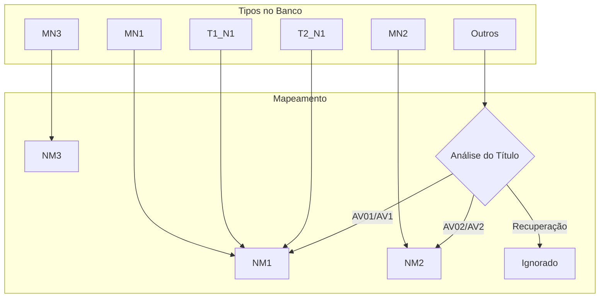
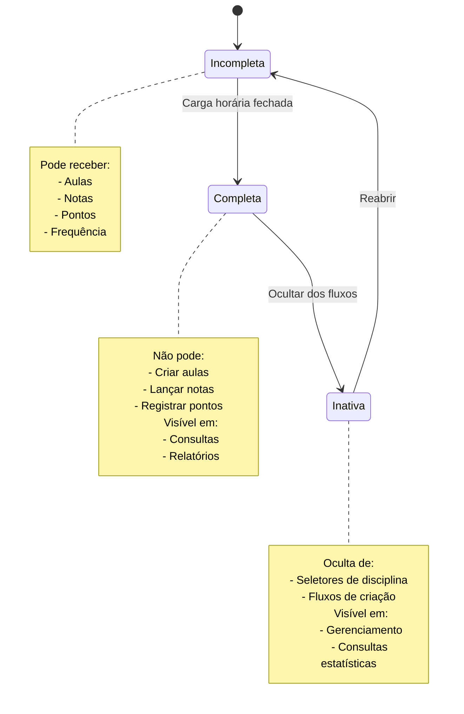
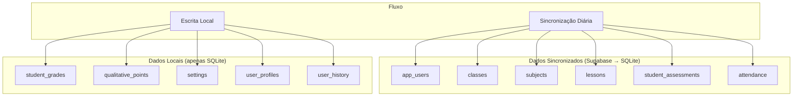
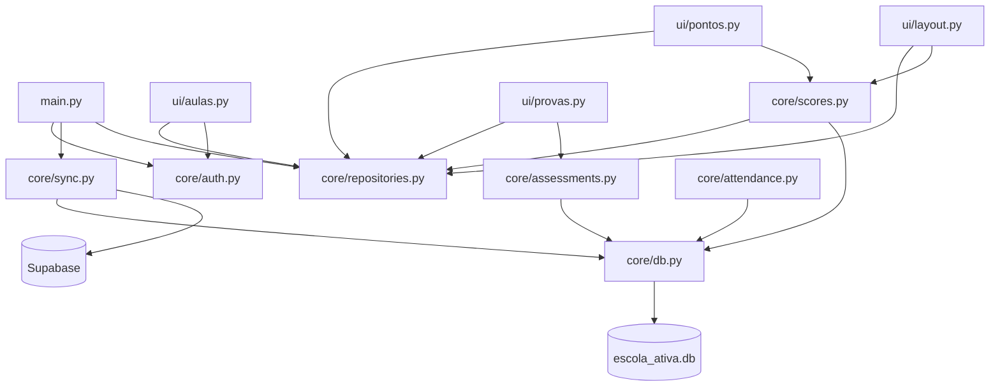

# Persistência de Dados — SysAVA NiceGUI

Este documento descreve como os dados são armazenados, sincronizados e
accessados no SysAVA, incluindo o fluxo completo desde o Supabase até
a interface do usuário.

---

## Visão Geral da Arquitetura



---

## Fluxo de Dados

### 1. Sincronização Supabase → SQLite



### 2. Acesso aos Dados (Leitura)



---

## Modelo de Dados (Entidades Principais)



---

## Tabelas do Banco de Dados

### Tabelas Principais

| Tabela | Descrição | Sincronizada |
|--------|-----------|--------------|
| `app_users` | Usuários (alunos, professores, admin) | ✅ |
| `classes` | Turmas | ✅ |
| `subjects` | Disciplinas | ✅ |
| `lessons` | Aulas | ✅ |
| `quizzes` | Quizzes | ✅ |
| `quiz_questions` | Questões dos quizzes | ✅ |
| `assessments` | Avaliações (MN1, MN2, etc.) | ✅ |
| `assessment_questions` | Questões das avaliações | ✅ |
| `student_enrollments` | Matrículas | ✅ |
| `student_assessments` | Submissões de avaliações | ✅ |
| `attendance` | Frequência | ✅ |
| `forum_posts` | Posts do fórum | ✅ |
| `user_history` | Histórico de atividades | ✅ |

### Tabelas Locais (não sincronizadas)

| Tabela | Descrição |
|--------|-----------|
| `student_grades` | Notas calculadas (local) |
| `qualitative_points` | Pontos qualitativos |
| `settings` | Configurações do sistema |
| `master_config` | Configuração mestre |
| `user_profiles` | Perfis de usuários |
| `user_reminders` | Lembretes |

---

## Fluxo de Notas (Scoring)

### Fórmula de Cálculo



### Detalhamento por Disciplina



---

## Mapeamento de Tipos de Avaliação



---

## Status de Disciplinas



---

## Sincronização vs Escrita Local



---

## Upsert Não-Destrutivo

O processo de sincronização usa upsert não-destrutivo:

```mermaid
graph TD
    START[Início] --> CHECK{Existe tabela?}
    
    CHECK -->|Não| CREATE[Criar tabela]
    CREATE --> INSERT[Inserir linhas]
    
    CHECK -->|Sim| COLS{Colunas novas?}
    COLS -->|Sim| ALTER[Adicionar colunas]
    COLS -->|Não| KEY[Determinar chave]
    ALTER --> KEY
    
    KEY --> EXIST{Registros existentes?}
    EXIST -->|Não| INSERT
    EXIST -->|Sim| COMPARE{Valores iguais?}
    
    COMPARE -->|Sim| SKIP[Pular (inalterado)]
    COMPARE -->|Não| UPDATE[Atualizar registro]
    
    INSERT --> LOG[Log de operação]
    UPDATE --> LOG
    SKIP --> LOG
    LOG --> END[Fim]
```

**Chave de upsert:** PK → Índice UNIQUE → Heurística

---

## Segurança e Sessão


---

## Estrutura de Arquivos

```
sysava-nicegui/
├── core/                    # Camada de dados e negócios
│   ├── auth.py              # Autenticação e sessão
│   ├── assessments.py       # Avaliações e submissões
│   ├── attendance.py        # Frequência
│   ├── conteudo.py          # Conteúdo de aulas
│   ├── db.py                # Conexão SQLite
│   ├── friction.py          # Radar de atrito
│   ├── logs.py              # Logging
│   ├── repositories.py      # Acesso read-only aos dados
│   ├── scores.py            # Cálculo de notas
│   ├── settings.py          # Configurações
│   ├── sync.py              # Sincronização Supabase
│   ├── turmas.py            # CRUD de turmas/disciplinas
│   └── user_profile.py      # Perfis de usuários
│
├── ui/                      # Camada de apresentação
│   ├── aulas.py             # Página de aulas
│   ├── config.py            # Configurações
│   ├── database.py          # Gerenciamento do banco
│   ├── frequencia.py        # Frequência
│   ├── friction.py          # Radar de atrito
│   ├── layout.py            # Layout compartilhado
│   ├── login.py             # Login
│   ├── manage_turmas.py     # Gerenciar turmas
│   ├── pontos.py            # Pontos do aluno
│   ├── perfil.py            # Perfil do usuário
│   ├── provas.py            # Provas e avaliações
│   ├── quiz.py              # Quizzes
│   └── sync.py              # Sincronização
│
├── data/
│   └── escola_ativa.db      # Banco SQLite local
│
└── main.py                  # Ponto de entrada
```

---

## Diagrama de Dependências



---

## Resumo

| Componente | Responsabilidade | Arquivo Principal |
|------------|------------------|-------------------|
| **Persistência** | Conexão e operações SQL | `core/db.py` |
| **Repositório** | Consultas read-only | `core/repositories.py` |
| **Sincronização** | Pull Supabase → SQLite | `core/sync.py` |
| **Autenticação** | Login, sessão, papéis | `core/auth.py` |
| **Notas** | Cálculo de NM1/NM2/NM3 | `core/scores.py` |
| **Turmas** | CRUD turmas/disciplinas | `core/turmas.py` |
| **Interface** | Páginas web | `ui/*.py` |
