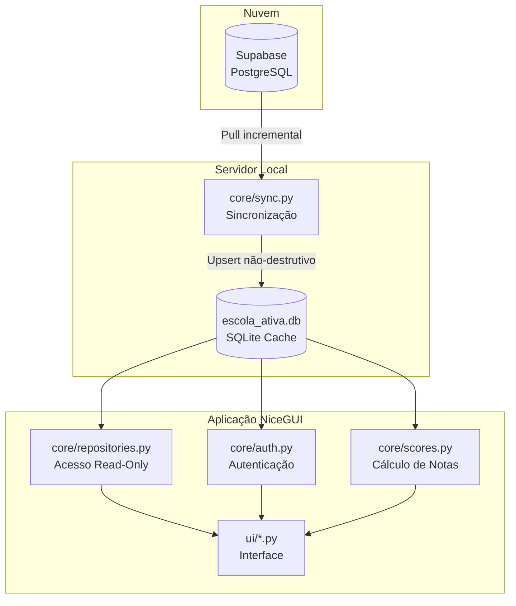
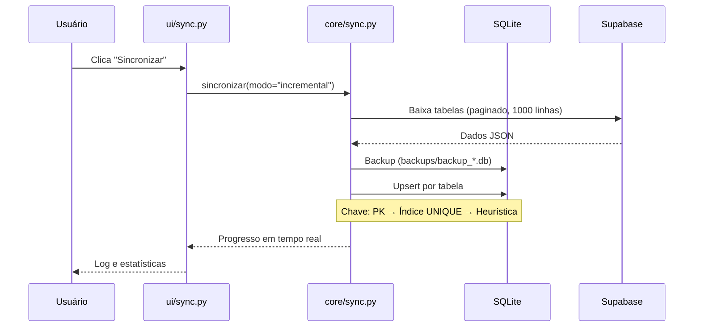
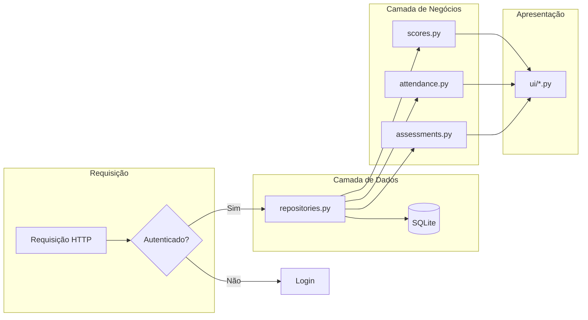
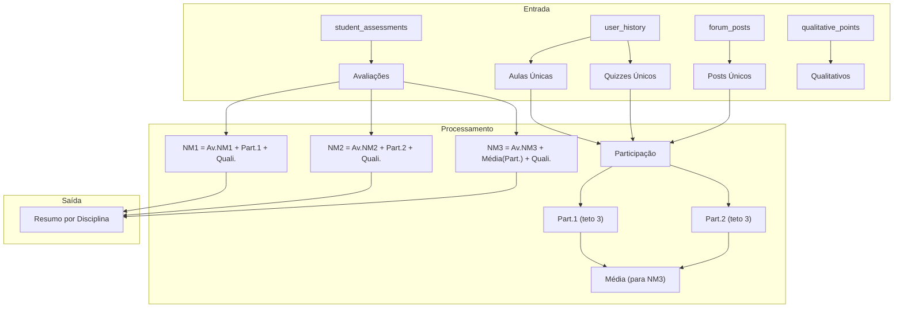
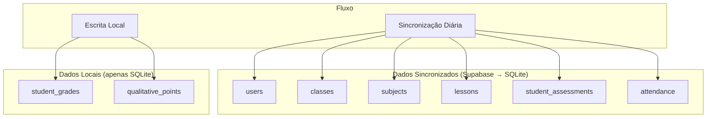
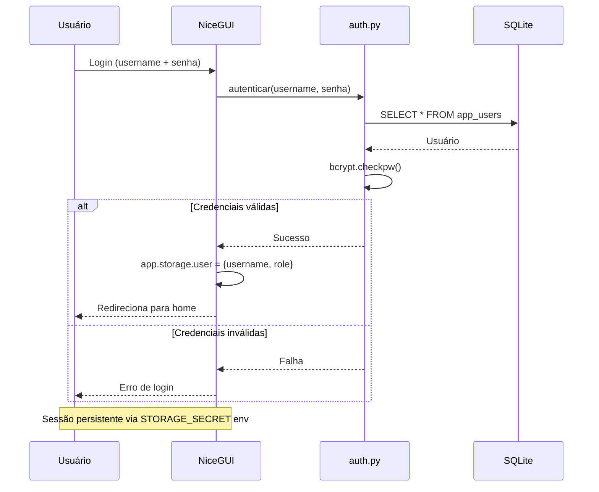

# Persistência de Dados — SysAVA NiceGUI

> **Nota:** Este documento descreve a arquitetura LEGADA. Para a nova
> arquitetura enxuta, ver `docs/ARQUITETURA_NOVA.md`.

---

## Visão Geral da Arquitetura



---

## Fluxo de Dados

### 1. Sincronização Supabase → SQLite



### 2. Acesso aos Dados (Leitura)



---

## Modelo de Dados (Entidades Principais)

```mermaid
erDiagram
    USERS {
        string username PK
        string name
        string ra
        string role
        boolean is_active
    }

    CLASSES {
        int id PK
        string name
        string code
        string tipo_turma
        string ano_letivo
        int school_id
    }

    SUBJECTS {
        int id PK
        string name
        string type
        int carga_horaria
        string duration_type
        string status
    }

    LESSONS {
        int id PK
        int subject_id FK
        string title
        string description
        string full_content
    }

    STUDENT_ENROLLMENTS {
        int id PK
        string user_username FK
        int class_id FK
    }

    CLASS_SUBJECTS {
        int id PK
        int class_id FK
        int subject_id FK
    }

    STUDENT_ASSESSMENTS {
        int id PK
        string user_username FK
        int assessment_id FK
        float score
        string status
    }

    ASSESSMENTS {
        int id PK
        int subject_id FK
        string type
        string title
    }

    ATTENDANCE {
        int id PK
        string class_name
        string student_name
        boolean is_present
        string status
        string date
    }

    USERS ||--o{ STUDENT_ENROLLMENTS : "matriculado em"
    CLASSES ||--o{ STUDENT_ENROLLMENTS : "turma"
    CLASSES ||--o{ CLASS_SUBJECTS : "disciplinas"
    SUBJECTS ||--o{ CLASS_SUBJECTS : "turmas"
    SUBJECTS ||--o{ LESSONS : "aulas"
    SUBJECTS ||--o{ ASSESSMENTS : "avaliações"
    USERS ||--o{ STUDENT_ASSESSMENTS : "submissões"
    ASSESSMENTS ||--o{ STUDENT_ASSESSMENTS : "notas"
}
```

---

## Tabelas do Banco de Dados (Novo Schema)

### Tabelas Essenciais (17)

| Tabela | Descrição | Sincronizada |
|--------|-----------|--------------|
| `users` | Usuários (alunos, professores, admin) | ✅ |
| `classes` | Turmas | ✅ |
| `subjects` | Disciplinas | ✅ |
| `class_subjects` | Turma ↔ Disciplina | ✅ |
| `student_enrollments` | Matrículas | ✅ |
| `lessons` | Aulas | ✅ |
| `quizzes` | Quizzes | ✅ |
| `quiz_questions` | Questões dos quizzes | ✅ |
| `assessments` | Avaliações | ✅ |
| `assessment_questions` | Questões das avaliações | ✅ |
| `student_assessments` | Submissões de avaliações | ✅ |
| `student_assessment_answers` | Respostas | ✅ |
| `attendance` | Frequência | ✅ |
| `forum_posts` | Posts do fórum | ✅ |
| `weekly_schedule` | Grade semanal | ✅ |
| `qualitative_points` | Pontos qualitativos | ✅ |
| `student_grades` | Notas calculadas | ✅ |

### Tabelas Eliminadas

| Tabela | Motivo |
|--------|--------|
| `historico_aulas` | Derivado de `user_history` |
| `master_config` | Mover para configuração local |
| `schedules` | Substituído por `weekly_schedule` |
| `schools` | Fundido em `classes.school_id` |
| `user_profiles` | Vazio, não essencial |
| `user_reminders` | Vazio, não essencial |
| `settings` | Configuração local, não AVA |
| `planejamento` | 0 registros |

---

## Fluxo de Notas (Scoring)

### Fórmula de Cálculo



---

## Sincronização vs Escrita Local



---

## Segurança e Sessão



---

## Resumo

| Componente | Responsabilidade | Arquivo Principal |
|------------|------------------|-------------------|
| **Persistência** | Conexão e operações SQL | `core/db.py` |
| **Repositório** | Consultas read-only | `core/repositories.py` |
| **Sincronização** | Pull Supabase → SQLite | `core/sync.py` |
| **Autenticação** | Login, sessão, papéis | `core/auth.py` |
| **Notas** | Cálculo de NM1/NM2/NM3 | `core/scores.py` |
| **Turmas** | CRUD turmas/disciplinas | `core/turmas.py` |
| **Interface** | Páginas web | `ui/*.py` |

Para a nova arquitetura enxuta, ver `docs/ARQUITETURA_NOVA.md`.
