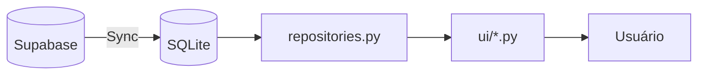

# 🎓 SysAVA — Plataforma de Ensino (NiceGUI)

Plataforma de ensino (LMS) desenvolvida com **NiceGUI** e **SQLite**, usando
Supabase como fonte de dados remota com sincronização para cache local.

---

## Funcionalidades

### 📚 Ensino
- **Aulas** — Conteúdo organizado por turma/disciplina com quizzes integrados
- **Quizzes** — Testes rápidos ao final de cada aula
- **Provas** — Avaliações formais (MN1, MN2, MN3) com questões objetivas
- **Fórum** — Discussões por aula (em desenvolvimento)

### 📊 Notas e Pontos
- **Sistema de Notas** — NM1, NM2, NM3 com fórmula personalizável
- **Participação** — Baseada em aulas, quizzes e fórum (teto 3 pontos)
- **Qualitativos** — Pontos extras do professor
- **Acesso Rápido** — Menu flutuante para consultar notas por turma/disciplina

### 👥 Gestão
- **Turmas** — Cadastro e gerenciamento de turmas
- **Disciplinas** — Cadastro com status (incompleta/completa/inativa)
- **Vínculos** — Associação turma × disciplina
- **Frequência** — Chamada diária com relatórios

### 🔧 Sistema
- **Sincronização** — Pull do Supabase para SQLite (incremental)
- **Backup** — Cópia automática antes de sincronizar
- **Configuração** — Settings editáveis pelo admin
- **Dashboard** — Visão geral com estatísticas

---

## Arquitetura

```text
sysava-nicegui/
├── core/                    # Camada de dados e negócios
│   ├── auth.py              # Autenticação e sessão
│   ├── assessments.py       # Avaliações
│   ├── attendance.py        # Frequência
│   ├── db.py                # Conexão SQLite
│   ├── repositories.py      # Acesso read-only
│   ├── scores.py            # Cálculo de notas
│   ├── sync.py              # Sincronização Supabase
│   └── turmas.py            # CRUD turmas/disciplinas
│
├── ui/                      # Camada de apresentação
│   ├── layout.py            # Layout compartilhado + menu flutuante
│   ├── aulas.py             # Página de aulas
│   ├── pontos.py            # Pontos do aluno
│   ├── provas.py            # Provas e avaliações
│   ├── frequencia.py        # Frequência
│   ├── manage_turmas.py     # Gerenciar turmas
│   └── ...
│
├── data/
│   └── escola_ativa.db      # Banco SQLite local
│
├── docs/
│   ├── PERSISTENCIA.md      # Documentação de persistência
│   └── ROADMAP_NICEGUI.md   # Roadmap do projeto
│
└── main.py                  # Ponto de entrada
```

---

## Como Executar

### Pré-requisitos
- Python 3.13+
- pip

### Instalação

```bash
# Clonar o repositório
git clone <url>
cd sysava-nicegui

# Criar ambiente virtual
python -m venv .venv
.venv\Scripts\activate  # Windows
# source .venv/bin/activate  # Linux/Mac

# Instalar dependências
pip install -r requirements.txt
```

### Configuração

1. **Banco de Dados**: Configure o caminho em `data/db_config.json`:
   ```json
   {
     "db_path": "D:\\Florestan\\Apps\\SysAva\\data\\escola_ativa.db"
   }
   ```

2. **Sincronização** (opcional): Configure as credenciais do Supabase:
   ```bash
   # Criar arquivo .env
   SUPABASE_URL=https://xxx.supabase.co
   SUPABASE_KEY=eyJxxx...
   ```

3. **Sessão**: Gere o segredo de armazenamento:
   ```bash
   python -c "from core import auth; auth.gerar_storage_secret()"
   ```

### Executar

```bash
python main.py
```

O servidor inicia em `http://127.0.0.1:8080`

---

## Fluxo de Dados



Para mais detalhes, veja [docs/PERSISTENCIA.md](docs/PERSISTENCIA.md).

---

## Sistema de Notas

| Componente | Fórmula | Teto |
|------------|---------|------|
| **Participação** | (aulas + quizzes + forum) / 16 | 3 pontos |
| **NM1** | Av.NM1 + Part.1 + Qualitativos | 10 pontos |
| **NM2** | Av.NM2 + Part.2 + Qualitativos | 10 pontos |
| **NM3** | Av.NM3 + Média(Part.) + Qualitativos | 10 pontos |

### Status de Disciplinas

| Status | Significado |
|--------|-------------|
| **Incompleta** | Pode receber aulas, notas, pontos |
| **Completa** | Fechada, sem novas atividades |
| **Inativa** | Oculta dos fluxos ativos |

---

## Documentação

- [Persistência de Dados](docs/PERSISTENCIA.md) — Diagramas e fluxos detalhados
- [Roadmap](docs/ROADMAP_NICEGUI.md) — Status do projeto e próximos passos

---

## Tecnologias

- **Frontend**: NiceGUI (Python + Quasar/Vue)
- **Backend**: Python 3.13
- **Banco Local**: SQLite
- **Banco Remoto**: Supabase (PostgreSQL)
- **Autenticação**: bcrypt + storage_secret

---

## Licença

Projeto interno para uso educacional.
